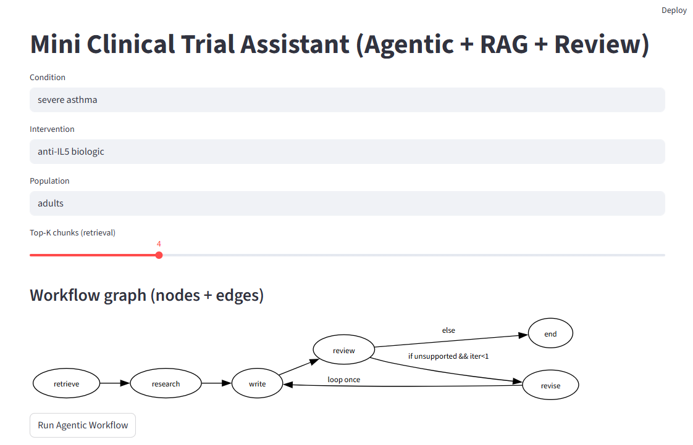
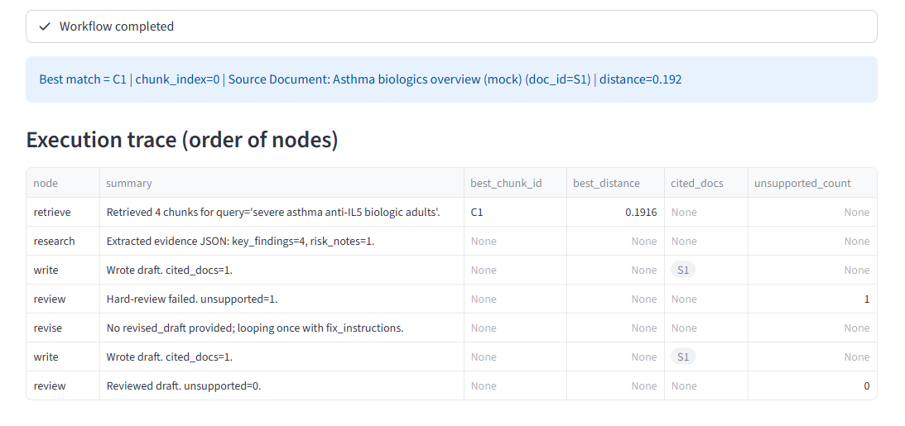
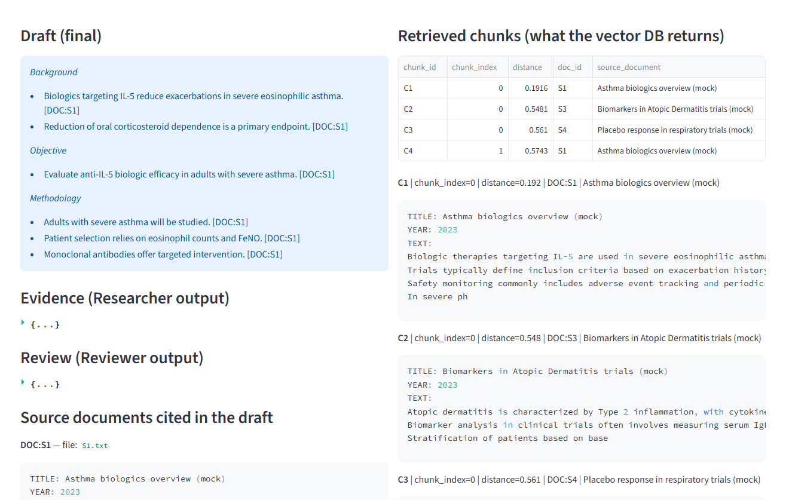
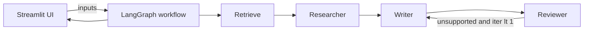

# Mini Clinical Trial Assistant (Agentic + RAG) — Demo 

A small, **production-minded learning demo** that simulates how AI systems can assist with **clinical-trial drafting** by combining:

- **RAG (Retrieval-Augmented Generation)** over local documents
- **Agentic workflow orchestration** with **LangGraph** (multi-step, stateful pipeline)
- **Grounding + review** to reduce hallucinations and enforce citations
- **Observability** in the UI (execution trace + intermediate artifacts)

This repo is intentionally **minimal** and focuses on the engineering patterns that matter in real GenAI products: state, retrieval, validation, and debuggability.

---

## Screenshots 

1) **UI overview** (inputs + agentic workflow graph)


2) **Execution traces** (traces + completed workflow)


3) **Draft & Retrieved chunks** (final draft + top-k chunks)


---

## What this demo does

Given:
- **Condition**
- **Intervention**
- **Population**

The app runs a workflow that:

1) **Retrieves** the most relevant document chunks from a local vector DB (Chroma)  
2) **Researches** key evidence into a structured JSON (claims + sources)  
3) **Writes** a concise clinical trial protocol draft (Background / Objective / Methodology)  
4) **Reviews** the draft for grounding and citation correctness  
5) *(Optional)* loops once to revise if unsupported content is detected (bounded loop)

The UI shows:
- **Workflow graph** (nodes + edges)
- **Execution trace** (order of nodes + summaries)
- **Retrieved chunks** (what the vector DB actually returned, with distances)
- **Researcher evidence JSON**
- **Reviewer JSON**
- Final **Draft** with citations in format: `[..., [DOC:S1]]`

> ⚠️ Disclaimer: This is a **technical demo**. It is **not medical advice** and does not replace clinical expertise.

---

## Architecture (high level)



### Components
- **Streamlit**: frontend + workflow runner
- **LangGraph**: state machine / orchestration (nodes, edges, conditional routing, loop)
- **Chroma (local)**: persistent vector store (`data/chroma/`)
- **SentenceTransformers**: embeddings for chunks + queries
- **LLM via API**: used for Researcher/Writer/Reviewer steps

---

## Workflow graph (nodes + edges)

Current pipeline:

- `retrieve → research → write → review`
- `review → revise → write` *(loop once only if needed)*
- `review → end` *(if no unsupported content or loop limit reached)*

In the Streamlit UI, the graph is rendered via Graphviz so the user can see the node/edge logic visually.

---

## Repo structure

```text
biorce-mini/
  data/
    docs/                 # Source documents (.txt)
    chroma/               # Local vector DB (auto-generated)
  src/
    rag.py                # Chunking, embeddings, Chroma indexing + retrieval
    llm.py                # LLM client wrapper (reads API key from .env)
    graph.py              # LangGraph workflow: retrieve/research/write/review/revise
  streamlit_app.py        # Streamlit UI (runs graph + shows trace/artifacts)
  ingest.py               # One-time indexing helper
  run_graph.py            # CLI runner for debugging the graph
  requirements.txt
  .env.example
  .gitignore
```

---

## Setup

### 1) Create a virtual environment
```bash
python -m venv .venv
# Windows:
.venv\Scripts\activate
# macOS/Linux:
# source .venv/bin/activate
```

### 2) Install dependencies
```bash
pip install -r requirements.txt
```

### 3) Configure environment variables
Copy the example file:

```bash
cp .env.example .env
```

Edit `.env` and set your API key.

Example:
```bash
GEMINI_API_KEY="YOUR_KEY_HERE"
```

> Note: if you use Gemini free tier, quotas apply (requests/day). During development it’s recommended to add caching or use an alternative provider.

---

## Data: adding documents

Add your knowledge base in:
- `data/docs/*.txt`

Suggested minimal format:
```text
TITLE: Asthma biologics overview (mock)
YEAR: 2023
TEXT:
...content...
```

This demo is designed to work with small mock docs (fast iteration), but you can add more documents as needed.

---

## Run the app

### 1) Index documents (first time only)
```bash
python ingest.py
```

### 2) Launch Streamlit
```bash
streamlit run streamlit_app.py
```

Open the local Streamlit URL shown in your terminal.

---

## How RAG works here (in plain terms)

1) Each document is split into **chunks**  
2) Each chunk is converted to an **embedding vector** (SentenceTransformers)  
3) Chunks + embeddings are stored in a local **Chroma** collection  
4) At query time, the input topic is embedded and the nearest chunks are retrieved by similarity  
5) The retrieved chunks are passed into the LLM as the **only allowed sources**

In the UI you can inspect:
- chunk ids
- doc ids/titles
- similarity distances
- chunk text

This makes the RAG stage **auditable**.

---

## Agentic workflow (LangGraph)

Instead of a single “prompt → answer” call, the app runs multiple steps with a shared **State**:

- **retrieve node**: fills `sources`
- **research node**: produces `evidence` JSON (claims + doc_ids)
- **write node**: produces the markdown draft using only sources
- **review node**: produces `review` JSON and flags unsupported content
- **revise node**: bounded loop (max 1) to revise when needed

### Communication between “agents”
There is no direct agent-to-agent chat.
Agents “communicate” by reading/writing fields in the **shared State** object.

---

## Grounding & review

The demo enforces:
- citations formatted like `[DOC:S1]`
- the Writer is instructed to use **only retrieved sources**
- the Reviewer checks grounding against sources and can request revisions

---

## Observability (why the UI matters)

The Streamlit UI is intentionally built to show the system “thinking”:

- **Execution trace** table: order of nodes + what each step did
- **Intermediate artifacts**: evidence JSON + review JSON
- **Retrieved chunks**: what the vector DB returned (not what the LLM “invented”)

This is key for debugging and mirrors real-world GenAI product needs.

---

## License
This project is licensed under the [MIT License](LICENSE).

---

## Acknowledgements
Built as a learning demo to explore **agentic workflows**, **RAG**, and **grounding** patterns in healthcare/clinical documentation contexts.
